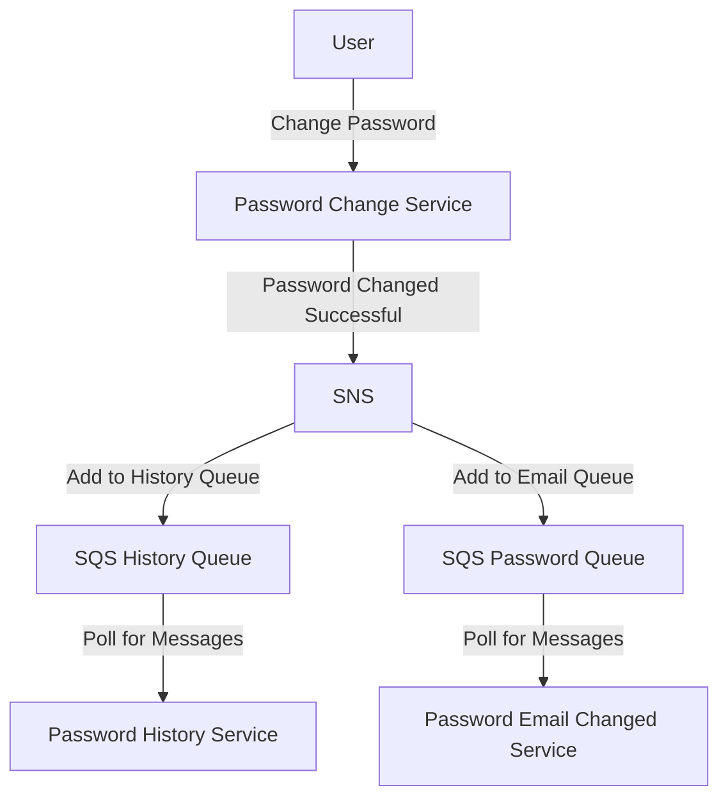

# Miscroservices Messaging using AWS SNS and SQS

# Links

- [AWS Messenging Video](https://www.youtube.com/watch?v=UesxWuZMZqI&feature=youtu.be)
- [SNS vs SQS](https://www.linkedin.com/pulse/difference-between-amazon-aws-snssimple-notification-sqs-khan-/)
- https://docs.aws.amazon.com/sdk-for-javascript/v2/developer-guide/sns-examples-publishing-messages.html
- [Distributted Trigger Pattern](https://www.jeremydaly.com/how-to-use-sns-and-sqs-to-distribute-and-throttle-events/)

## Example Overview Service to Service messaging

- Password Change Service
- Password History Service
- Password Email Changed Service

## Diagram

# Sample Code
