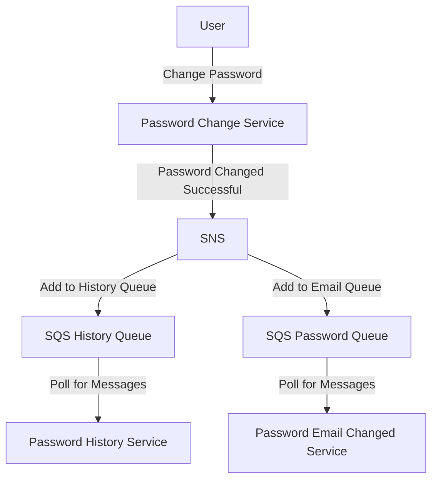

## Summary

Proof of Concept on how to use SNS and SQS for messenging between Microservices.

SNS - Amazon Simple Notification Service is a highly available, durable, secure, fully managed pub/sub messaging service that enables you to decouple microservices, distributed systems, and event-driven serverless applications. Amazon SNS provides topics for high-throughput, push-based, many-to-many messaging.

SQS - Amazon Simple Queue Service is a fully managed message queuing service that enables you to decouple and scale microservices, distributed systems, and serverless applications.

## Links

- [How To: Use SNS and SQS to Distribute and Throttle Events](https://www.jeremydaly.com/how-to-use-sns-and-sqs-to-distribute-and-throttle-events/)
- [AWS Messenging Video](https://www.youtube.com/watch?v=UesxWuZMZqI&feature=youtu.be)
- [SNS vs SQS](https://www.linkedin.com/pulse/difference-between-amazon-aws-snssimple-notification-sqs-khan-/)
- https://docs.aws.amazon.com/sdk-for-javascript/v2/developer-guide/sns-examples-publishing-messages.html


## Example Overview of Service to Service Messaging

Imagine we have 3 microservices:

- Password Change Service
- Password History Service
- Password Email Changed Service

When we change passwords, we would like to record the chage in history and also inform the user that the change was succesful via email.

By using SNS and SQS, we can decouple the services. After the password change is succesful, the Password Change Service sends a notification to a TOPIC in SNS.

Two Queues are subscribed to this Topic. The history service queue and the email change queue. Both of these services, poll their respective queues for messages.

They receive and remove incoming messages in their queues.

## Diagram



# Sample Code

### Setup

This creates an SNS Topic and 2 SQS Queues. It subscribe the Queues to the topic and set policy to allow SNS Topic to send messages to the Queues.

```
./scripts/setup
```

We should only do this once per environment.

### Receive Messages

On a separate terminal, run the receive messages. This code runs in a loop. Polling every X minutes for messages for both Queues. Once it receives a message, it removes the message from the Queue.

```
./scripts/recieveMessage
```

### Send Message

Sends a message to the SNS Topic which will forward the message to both Queues.

```
./scripts/recieveMessage
```

### Cleanup

Deletes the SNS Topic and both SQS Queues

```
./scripts/recieveMessage
```
